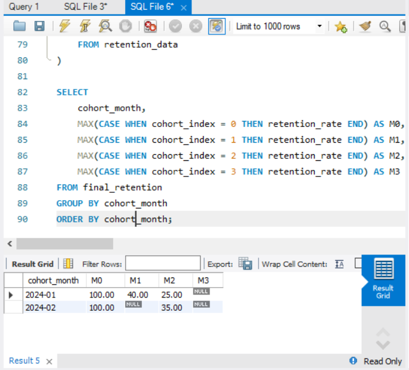

# 📊 Cohort Retention Analysis (SQL | Product Analytics)

## 🔍 Project Overview

Understanding user retention is critical for any product-driven business. While acquiring users is important, long-term growth depends on how well users continue to engage with the product.

This project focuses on analyzing **user retention behavior over time** using **cohort analysis**.

---

## 🎯 Business Problem

The product team wants to answer:

* Are users coming back after their first purchase?
* How does retention vary across different cohorts?
* Do newer users retain better than older users?
* Where are we losing users in the lifecycle?

---

## 🧠 Approach & Methodology

The analysis is structured into logical steps:

### 1. Cohort Identification

* Group users based on their **first purchase date**
* Each cohort represents users acquired in the same month

### 2. User Activity Tracking

* Track user transactions across subsequent months
* Measure engagement over time

### 3. Retention Calculation

* Count returning users for each cohort
* Calculate retention percentage relative to cohort size

### 4. Cohort Matrix Creation

* Transform results into a **pivot-style retention table**
* Enables easy comparison across cohorts

---

## 🛠️ Tools Used

* **MySQL Workbench**
* SQL (CTEs, Window Functions, Aggregations)

---

## 📂 Project Structure

```
cohort-retention-analysis-sql/
│
├── datasets/
│   └── transactions.csv
│
├── sql/
│   ├── 01_cohort_base.sql
│   ├── 02_cohort_activity.sql
│   ├── 03_retention_counts.sql
│   ├── 04_retention_percentage.sql
│   └── 05_cohort_matrix.sql
│
├── image/
│   ├── cohort_analysis.png
│
└── README.md
```

---

## 📊 Key Output

#### 🔹 Cohort Retention Matrix

| Cohort  | M0   | M1  | M2  | M3  |
|---------|------|-----|-----|-----|
| 2024-01 | 100% | 40% | 25% | -   |
| 2024-02 | 100% | -   | 35% | -   |

---

## 📈 Key Insights

- Significant drop from **Month 0 to Month 1 (100% → 40%)** for the Jan cohort indicates strong early churn
- Retention further declines to **25% by Month 2**, showing weak long-term engagement
- Feb cohort shows **no retention in Month 1**, but partial recovery in Month 2 (35%), indicating inconsistent user behavior
- Missing values suggest **limited user return activity or smaller cohort size**

---

## 🧠 Business Interpretation

- Users are dropping off immediately after first interaction, indicating potential onboarding or value gap
- Lack of retention in early months suggests weak engagement strategies post-acquisition
- Inconsistent behavior across cohorts may indicate variability in user quality or acquisition channels
- Opportunity exists to improve early lifecycle engagement and retention mechanisms

---

## 🚀 Key Learnings

* Applied **cohort analysis** to track user behavior over time
* Used **window functions** to compute retention metrics
* Built a **cohort matrix** for decision-making
* Translated SQL output into **business insights**

---

## 📌 Conclusion

This project demonstrates how SQL can be used not just for querying data, but for solving real-world product analytics problems and driving business decisions.

---

## 🔗 Future Improvements

* Build dashboard in Power BI / Tableau
* Add segmentation (by region, product category, etc.)
* Perform churn prediction analysis

---

## Sample Outputs

### Complete Retention Analysis



